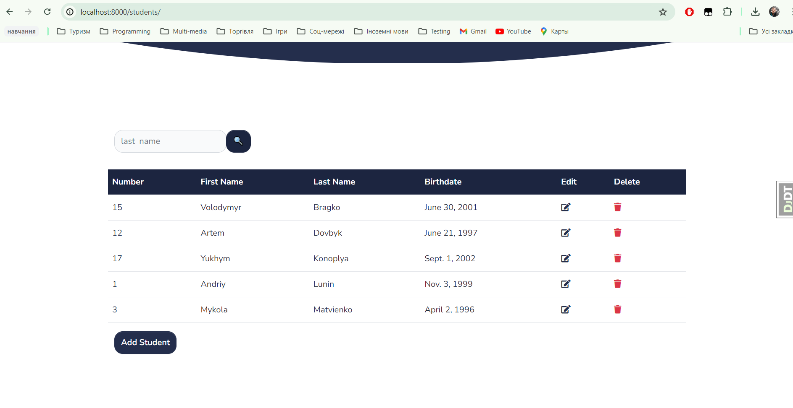

# Students Journal
> Django project for managing student groups.

# Project Description
The main goal of the project is to create tools for managing groups of students. 
The users of this system are specifically defined as teachers, 
who have all the main capabilities for manipulating data on the site. 
Creating, editing, and deleting data is only possible for registered users. 
The project uses key dependencies, such as ManyToMany and OneToOne relationships, 
dictated by the specific interactions between classes.

In the project, there are lists of students, teachers, subjects, and groups. 
Students are distributed among groups, and accordingly, when editing a group, 
students can be added or removed. Each group has its leader, who can only be one, and each group has a unique leader.

In the student lists, there is an option to add a new student by providing the necessary basic information. 
Links to detailed information about each student are contained in the ID of each student.

In the teacher lists, there is a separate parameter called "username," which distinguishes the teacher as a user. 
A new user can only be created from a logged-in account by filling out the appropriate form. 
Details about teachers can be seen by following the link contained in each teacher's username.

The subject list is designed for extracurricular activities, 
meaning a certain number of students are assigned to these subjects, 
and these subjects are not mandatory for all students. 
Adding and removing students assigned to a subject can be done in the detailed information 
about the subject by following the link contained in the subject's name. 
Each subject is assigned to only one unique teacher.

The tabs for about, support, and contact do not contain any data and lead to the homepage; 
they are left for implementation in the next version.

Assigning students to groups or assigning new students to certain subjects is done using checkboxes. 
This approach is convenient for now, but it may lose its relevance as the number of students increases.

## Check It out


## Getting Started
1. Copy `.env.example` to `.env`
2. Replace placeholder values with your actual configuration.

## Installation

python must be already installed

```shell
git clone https://github.com/struhanets/students_journal.git
cd students_journal
python3 -m venv venv
source venv/bin/activate
pip install -r requirements.txt
python manage.py runserver # starts Django server
```

## Features

* Authentication functionality for Teacher/User
* Management of student groups and assigning students to specific subjects
* The ability to create new users, edit information about students, groups, and subjects

## Demo
